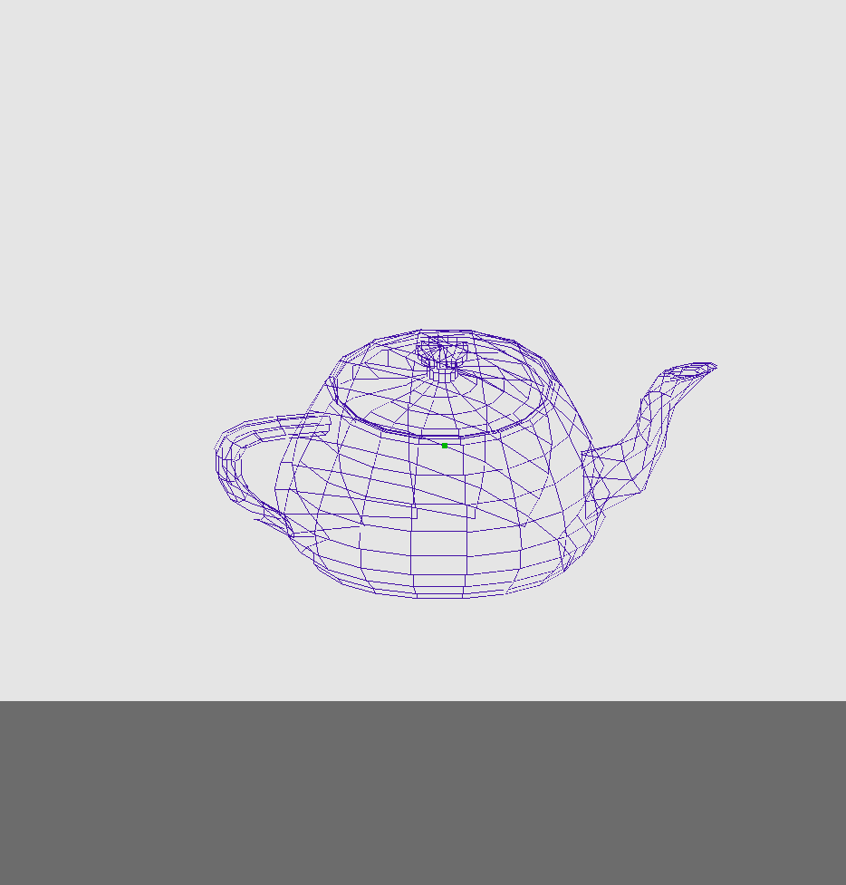
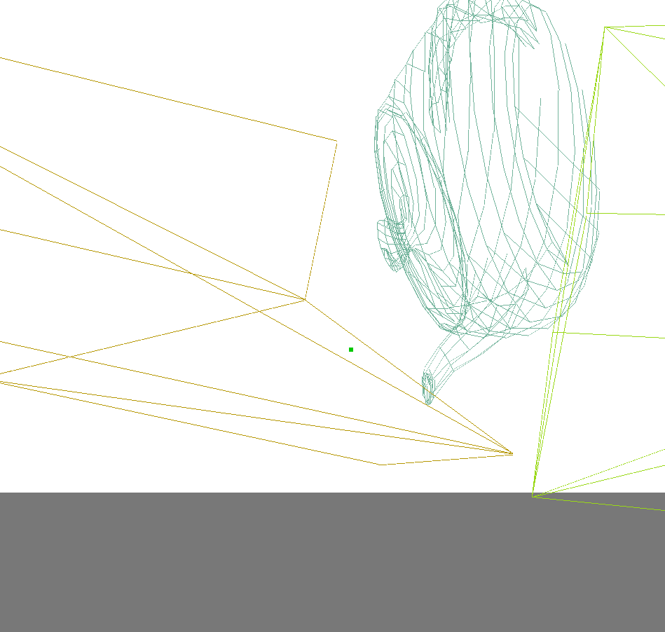
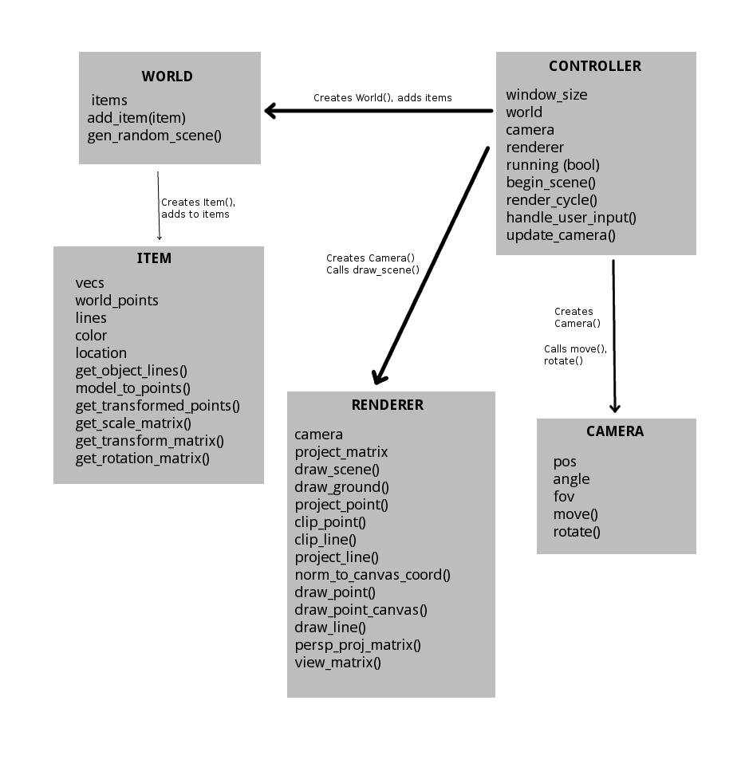

# Mini-Project 4: Project Writeup/Reflection
##### Interactive 3D Graphics/World Generation
##### Adam Novotny, Matt Brucker

### Project Overview
The goal of this project was to create an interactive 3D environment from scratch
. Over the course of this project, we implemented the basics of a 3D rendering engine in Python, by learning the matrix math required to convert 3D objects into points and space and points in space to points on the screen; used that to create a 3D environment that could be displayed; and added in the ability to move and look around within the environment. We also used a very simple random world generation to add some variety.

### Results
**Graphics**
Overall, our program works as intended. We were able to create a simple 3D graphics engine that takes a 3D object, represented as a series of points, and projects a wireframe of that object. Additionally, we created a fairly robust system of user input; the mouse is able to control the view of the camera, and WASD is used to move the camera around in space. A sample image of what it looks like is displayed below: our rendition of the Utah teapot.

**Landscape Generation**
We were able to get our project to the point of simple landscape generation. Every time the program is initialized, it generates a number of random objects with various shapes, size, positions, and orientations, and places them all in the world. There is no interaction between the user and objects, or between objects themselves, but the user can move around and look at the objects from various positions.

**Performance**
In terms of computational performance, our program runs fairly slowly. Very simple objects such as boxes, with only a few lines and vertices, can be rendered very quickly, generally over 60 FPS. However, as the number of objects, and the complexity of the objects, increases, the graphics engine slows down considerably. Additionally, the closer the user gets to objects, the longer it takes to render the individual objects.

### Implementation
We implemented our engine using five classes, as shown below.

At the lowest level, the Item class represents a single object in the world. It builds a list of triangles by importing an STL file and converting it to points; then, it scales, translates, and rotates each of the points by factors that are passed in as arguments to the constructor, and turns the points into a list of lines connecting them. The end result is a series of lines in what is called "world space," the three-dimensional Cartesian space in which all positions are relative to a single origin. The World class acts as a wrapper for Items; it contains a list of Item objects, which can be added to, as well as a function to populate itself with random objects.

In order to convert the vertices and edges of the objects into projections onto the 2D view of the user, a Camera object is needed. The Camera object occupies a point in world space, with an initial position, orientation, and FOV that can be set in the constructor; it can also be moved and rotated.

The Renderer class takes the World and Camera and uses their positions/orientations to create the actual projection that appears on-screen. When draw_scene() is called, it loops through each Item in World and projects its points. To do this, it first transforms each point into "view space," a shifted coordinate system with the origin at the point of the camera and the +z axis pointing in the direction of the camera view, by operating on each point with a view transformation matrix. Then, a projection matrix transforms each point into projection space, where the x and y values of the point represent the actual pixel position it occupies on-screen. Finally, points that are out of the camera view are culled, and lines are drawn on the frame before it's displayed.

In order to turn all of this into a functional program, the Controller class is used. It creates new World, Camera, and Renderer objects, and updates each of them accordingly. It uses multithreading to avoid as much lag between input and rendering as possible; one thread continually loops and calls draw_scene() on the Renderer object, and the other takes in mouse/keyboard input using pygame and updates the position/orientation of the Camera object accordingly. Together, these five classes allow the environment to be displayed and updated with inputs from the user.

### Reflection

**Matt**
Overall, I think the process we used to develop our project worked well. We definitely knew what tasks we needed to complete from the beginning, because the original class diagram we laid out at the start is essentially how we ended up structuring our program. I'd say that the division of labor was fairly effective as well; we didn't have a formal process of handling it, but we each tackled things as they came up. I ended up doing more of the user input/controller tasks while Adam did more of the math behind rendering, but I think we each got a decent amount of exposure to every aspect of the project. The one thing I think we could have done more effectively was project scoping; we definitely went in to the project thinking we would be able to accomplish more than we could. Even though we did end up with a fully working product, we didn't end up adding many of the things we were hoping to; I think we would have benefited from being more realistic about what we could accomplish. Still, I'm very happy with the end product.
